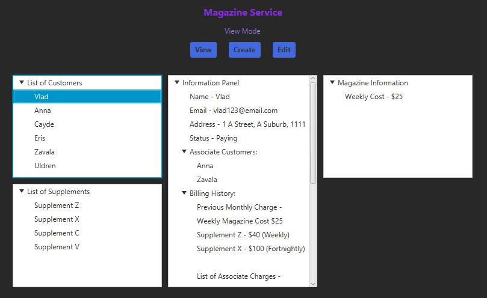

# Magazine-Service
3rd Year University Assignment for a Graphical User Interface to operate a magazine service, written in Java. Involving the use of JavaFX and multi-threading, while utilising principles such as polymorphism, serialisation and separation of GUI/Business logic.

